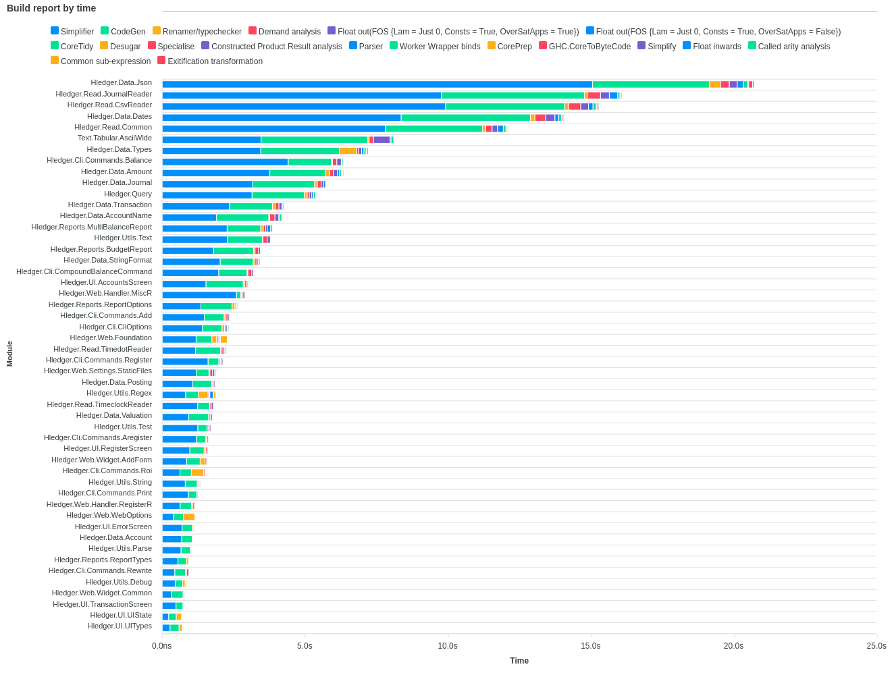

# time-ghc-modules

Figure out why your builds are slow. This tool analyzes how long it takes GHC to compile your Haskell modules, broken down by phase.

# Quick start

``` shell
git clone git@github.com:codedownio/time-ghc-modules.git

cd <my-project>

stack clean
stack build --ghc-options "-ddump-to-file -ddump-timings"
# ----- OR -----
cabal clean
cabal build --ghc-options "-ddump-to-file -ddump-timings"
```

If you have Nix, in the same folder just run:

``` haskell
/path/to/time-ghc-modules/time-ghc-modules-nix
```

Otherwise, you need to have the following installed: `SQLite >= 3.33.0`, `Python 3`, and `sed`.

``` haskell
/path/to/time-ghc-modules/time-ghc-modules
```

The script will search for all your `*.dump-timings` files and analyze them. It will finish by printing out the path to an HTML file:

``` shell
...
--> Wrote report at file:///tmp/tmp.pvnp4FYmLa/report.html
```

# Example: hledger

You can generate the time report below for [hledger](https://github.com/simonmichael/hledger) by running the following commands (assuming you have Nix).

``` bash
set -e
cd $(mktemp -d)
git clone git@github.com:simonmichael/hledger.git
git clone git@github.com:codedownio/time-ghc-modules.git
cd hledger
stack build --ghc-options "-ddump-to-file -ddump-timings"
../time-ghc-modules/time-ghc-modules-nix
```



# Compatibility

The flag `-ddump-timings` is available for `GHC >= 8.4.1`.
